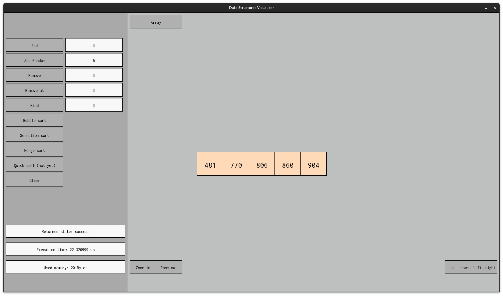

# Datastructures Visualizer 

---
## About the Project
a simple data structures visualizer for the most known data structures out there.
## Instalation
The project UI has been built on top of the SFML library ([SFML doc](https://www.sfml-dev.org/)), you can install it from [here](https://www.sfml-dev.org/download.php).
## Usage
When you first open the programme it gana look some thing like:

As you can see its very simle, at the left you have the available methodes for the selected data structure and some information like the last methode execution time and returned state and the memory usage of the entire data structur.

You can change the data structure via the button at the top.

You can zoom in and out using the mouse wheel or the buttons at the bottom, and you can move it up down right or left with the arrows keys.

